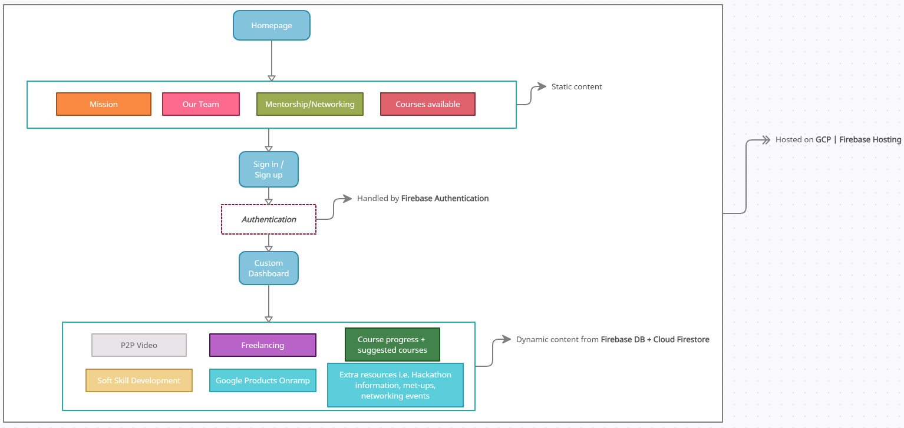

# theX - Serving Real Justice

    

## The life of Malcolm X

    

> In 1946, twenty-year-old Malcom X began serving an eight-to-ten year prison sentence for burglary. Prison generally has the effect of hardening the criminal and narrowing his already narrow view of the world. Instead, Malcolm decided to reassess his life. He began to spend time in the prison library and fell in love with books and learning. As he saw it now, prison afforded him the best possible means of changing himself and his attitude toward life. With so much time on his hands, he could study and earn himself a degree. He could develop the discipline he had always been missing. He could train himself to become an expert speaker. He embraced the experience without any bitterness and emerged stronger than ever. Once he left prison, he saw any difficulty, large or small, as a means to test and toughen himself.

## Our mission

    

As part of the **[Solution Challenge 2021](https://developers.google.com/community/dsc-solution-challenge)** hosted by the **[Google Developer Student Club (GDSC) community](https://developers.google.com/community/dsc)**, the GDSC team from **[Queen Mary, University of London](https://dsc.community.dev/queen-mary-university-of-london/)** want to help break the serpentine gyration of poverty, crime and punishment. 

We want to educate and equip individuals with a criminal record with the necessary skills needed to work professionally in the technology industry, and to develop their professional network that will allow them to reintegrate back into society. It is unfair to marginalise individuals who were surrounded with a constellation of bad choices throughout their formative years culminating in criminal records, and to add insult to injury, the criminal justice system then perpetuates the social segregation and ostracization by making them declare their mistakes to future employers via a background criminal record check.

Ask yourself, what you would have done if _any_ path you took led to breaking the law, especially in your teenage years? 

After being released from prison, one has to keep declaring one's criminal record for 7 years after the license period ends. How is this fair? By handicapping them so every employer who does a background check immediately infers that the individual was a born criminal? Why is the system like this? Why is no one talking about this? What is happening to the 11 million people in the U.K. with a criminal record? Where is all the money coming from to keep individuals in cages, but not to invest in their area or education? Is justice really blind? 

These are tough questions with no certain answer. Yet, we believe the first step is to highlight this issue and atleast have an open dialogue about it. No more muted responses or obtuse arguments about contestable moral turpitude. The UK has a tremendous tech. skills shortage and we aim to curtail it whilst decreasing the reoffending rate. 

## Statistics 

### Prison

* Prison numbers in England and Wales have increased by 84% since 1990, from 44,975 to just under 83,000 today. The overall cost of the criminal justice system has risen from 2% of GDP to 2.5% over the last 10 years. That is a higher per capita level than the US or any EU country. Each new prison place now costs £170,000 over the life of the accommodation. The cost per prisoner per year is £41,000. 

* 47% of adults are reconvicted within one year of being released from prison. For petty offenders, serving sentences of less than 12 months, this increases to 60%. For children and young people in custody the rate of reoffending rises to 75%. Reoffending by ex-prisoners’ costs society at least £11bn per year. The cost per prisoner per year is £41,000. 

### Tech. shortage

* 70% of employers anticipate a shortage, with almost a quarter (24%) expecting it to greatly impact their recruitment.
* According to CTOs, Cyber Security (56%), BI & Data Management (41%) and Software Development (35%) are the most sought after skills this year.
* Two-thirds (36%) of technology hiring managers believe the recruitment process takes too long.
* Nearly 8 in 10 technology candidates search for their next opportunity on online job boards.
* More than half of employers find candidates lack the right technical skills necessary for technology positions.

## Installation Guide [WINDOWS]
* Install **[Node.js](https://nodejs.org/en/download/)** 
* Clone the repository to your local machine: `https://github.com/mughees-asif/dsc-2021.git`
* Open terminal and navigate to the directory: `cd dsc-2021`
* Check Node is installed correctly: `node -v` [version number should display]
* Install **Yarn** [package manager]: `npm install -g yarn`
* Check Yarn is installed correctly: `yarn -v` [version number should display]
* Install **Gatsby CLI** [command line interface]: `npm install -g gatsby-cli`
* Check Gatsby is installed correctly: `gatsby -v` [version number should display]
* Install **dependencies**: `yarn install` [make sure to be in the same folder as the `package.json` file!!!!]
* Run development server: `yarn dev` OR `gatsby dev` [both work]
* Go to your browser and in the address bar: `http://localhost:8000/` 

## Architecture overview

    

## Developers

* Shannon Francis - 2nd Year Computer Science 
* Pedro Camara - 2nd Year Computer Science
* Vigna Kumar - 3rd Year Computer Science
* Mughees Asif - 3rd Year Aerospace Engineering